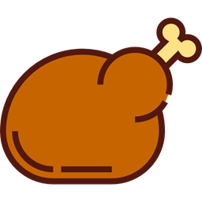

# 🧨 Tabpocalypse

**Tabpocalypse** is a browser extension that does what your friends won’t:  
**roasts you mercilessly for hoarding tabs like a digital dragon.**

---

## 🔥 What It Does

- Detects when you have **too many tabs open**  
- Randomly delivers a **popup roast** or **desktop notification**  
- Injects roasts directly into webpages for max humiliation  
- Tracks your **peak tab count** and **total roasts received**  
- Lets you toggle **Mercy Mode** if you’re not emotionally prepared  
- Totally unnecessary. Absolutely essential.

---

## 📸 Screenshots

Coming soon... or never. Open more tabs and find out.

---

## 🛠️ Features

| Feature            | Status   |
|--------------------|----------|
| Popup UI           | ✅ Done  |
| Roast notifications| ✅ Done  |
| Mercy Mode toggle  | ✅ Done  |
| Roast injection    | ✅ Done  |
| Tab tracking       | ✅ Done  |
| Randomized roasting| ✅ Done  |
| Chrome support     | ✅ Done  |
| Opera support      | ⚠️ YMMV  |
| Firefox support    | 💤 Maybe later

---

## 🧪 Dev Instructions

To run locally:

1. Clone or download the repo
2. Open Chrome → `chrome://extensions`
3. Enable **Developer Mode**
4. Click **"Load unpacked"**
5. Select the root `tabpocalypse/` folder
6. Open too many tabs and regret everything

---

## 💀 Philosophy

This extension exists because you have:
- 73 tabs open
- Zero self-control
- And no one telling you to stop

Until now.

---

## 📜 License

MIT — Do whatever. Just don’t claim you’re innocent when this becomes sentient.

---

## ✨ Created By

👾 [Shaun M](https://github.com/RatchetAndSkank)  
Fueled by caffeine, spite, and too many tabs.

